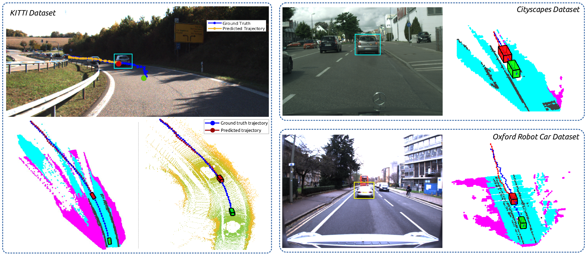

# INFER: INtermediate representations for FuturE pRediction



This repository contains code and data required to reproduce the results of **INFER**

### Datasets
In order to use this code, you need to download the intermediate representations datasets used by our network. 

The link to the dataset is given [here](https://drive.google.com/file/d/1XUchHU47P_0p9Y-WnwaGYqX6pve4wtaX/view?usp=sharing)

### Installations

The code has been tested with `python3` and `PyTorch 0.4.1`. 

In order to install all the required files, create a virtualenv and install the files given in `requirements.txt` file.

```
virtualenv -p python3.5 venv
source venv/bin/activate
pip install -r requirements.txt
```

### Running the demo scripts
In order to run our evaluation script for KITTI, run the file `infer-main.ipynb` after changing the appropriate paths of `repo_dir` and `data_dir` in the code. 

The scipts for transfer to Cityscapes & Oxford can be run in the same way.

### Training

Training the network on a single split of KITTI takes about 8-10 hours in an NVIDIA GeForce GTX 1080Ti GPU.

You can run the training code as follows:

```
python train.py -expID split-0 -nepochs 60 -dataDir /home/username/kitti -optMethod adam -initType default -lr 0.000100 -momentum 0.900000 -beta1 0.90000 -modelType skipLSTM -groundTruth True -imageWidth 256 -imageHeight 256 -scaleFactor False -gradClip 10 -seqLen 1 -csvDir /home/pravin.mali/merged/final-validation/ -trainPath train0.csv -valPath test0.csv -minMaxNorm False
```

The different parameters available are given in the file `args.py`

### Pretrained Models

All other pretrained models are available on request. 